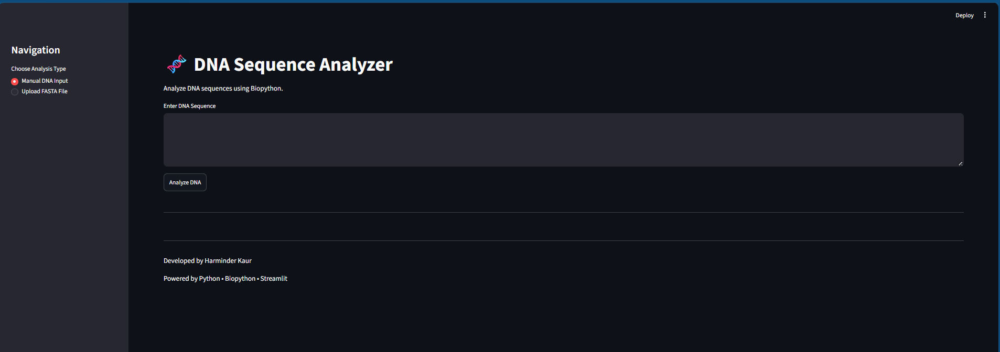
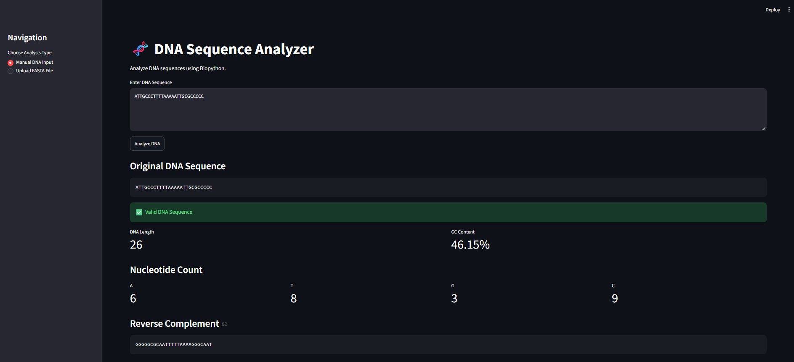
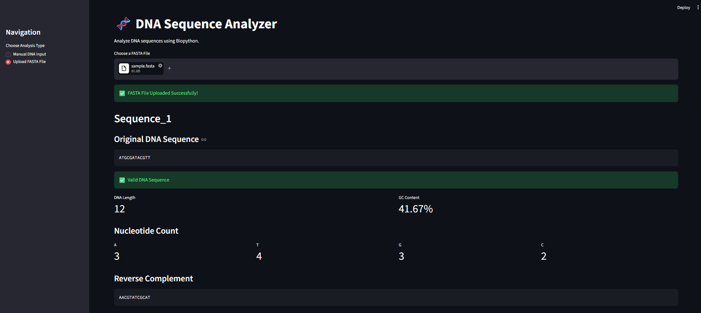

# 🧬 DNA Sequence Analyzer

A beginner-friendly bioinformatics web application built with **Python**, **Biopython**, and **Streamlit** that analyzes DNA sequences and performs common molecular biology operations.

---

## 📌 Project Overview

The DNA Sequence Analyzer allows users to manually enter DNA sequences or upload FASTA files for analysis.

The application validates DNA sequences and performs several bioinformatics analyses including GC content calculation, nucleotide counting, reverse complement generation, transcription, and protein translation.

This project was developed as part of my Bioinformatics and Python learning journey.

---

## ✨ Features

- ✅ Manual DNA sequence input
- ✅ FASTA file upload
- ✅ DNA sequence validation
- ✅ DNA length calculation
- ✅ GC content calculation
- ✅ Nucleotide count (A, T, G, C)
- ✅ Reverse complement generation
- ✅ DNA → RNA transcription
- ✅ RNA → Protein translation
- ✅ Download analysis report
- ✅ Clean Streamlit web interface

---

## 🖥️ Application Preview

### Home Page



### DNA Analysis



### FASTA File Analysis



---

## 🧬 Technologies Used

- Python 3
- Biopython
- Streamlit

---

## 📂 Project Structure

```text
DNA_Sequence_Analyzer/
│
├── app.py
├── dna_analyzer.py
├── sample.fasta
├── requirements.txt
├── README.md
├── LICENSE
├── .gitignore
└── screenshots/
    ├── home.png
    ├── manual_analysis.png
    └── fasta_analysis.png
```

---

## ⚙️ Installation

Clone the repository

```bash
git clone https://github.com/harminderkaur1329/DNA_Sequence_Analyzer.git
```

Move into the project folder

```bash
cd DNA_Sequence_Analyzer
```

Install the required libraries

```bash
pip install -r requirements.txt
```

---

## ▶️ Run the Application

```bash
streamlit run app.py
```

The application will automatically open in your web browser.

---

## 📄 Sample FASTA File

Example

```text
>Sequence_1
ATGCGATCGATCGATCGATCGATCGATCG

>Sequence_2
ATTTGGGGCCCCAAAATTTGGGCCC
```

---

## 📊 Example Output

The application generates:

- DNA Length
- GC Content
- Nucleotide Counts
- Reverse Complement
- RNA Sequence
- Protein Sequence
- Downloadable Analysis Report

---

## 🎯 Learning Outcomes

During this project I learned:

- Python programming
- Functions
- Biopython
- Streamlit
- FASTA file parsing
- DNA sequence validation
- File handling
- Building bioinformatics tools

---

## 🚀 Future Improvements

- GC Content visualization
- Nucleotide frequency charts
- DNA motif search
- Restriction enzyme analysis
- DNA molecular weight calculation
- Amino acid composition analysis

---

## 👩‍💻 Author

**Harminder Kaur**

B.Tech Biotechnology

Aspiring Bioinformatics & AI Researcher

---

## ⭐ Support

If you found this project helpful, consider giving it a ⭐ on GitHub.
